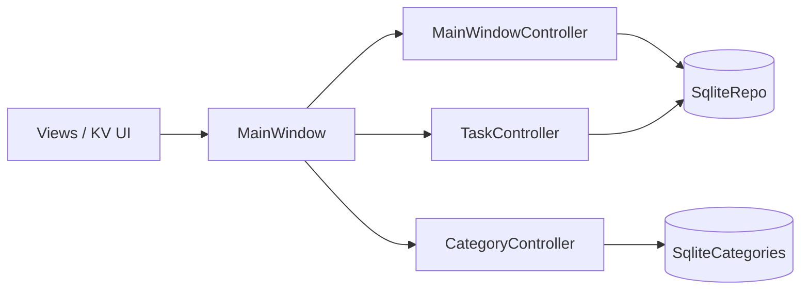
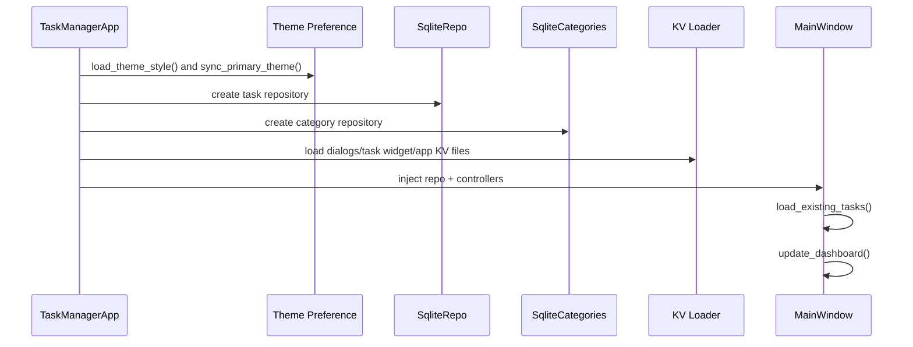

# Task Manager App (KivyMD + MVC)

A desktop task manager built with Python, KivyMD, and SQLite using an MVC-style structure. The app supports task CRUD workflows, category management, dashboard stats, Kanban-style views, and saved theme preferences.

## Current Features

- Create, edit, and remove tasks
- Persist tasks in SQLite via repository classes
- Manage categories with dedicated category controllers/repositories
- Dashboard and Kanban-oriented task views
- Dialog-driven task workflows
- Saved theme style and synced primary color preferences

## Architecture (Mermaid)



## Startup Flow (Mermaid)



## Project Structure

```text
task_manager_app/
├── src/
│   ├── main.py
│   ├── controller/
│   │   ├── main_window_controller.py
│   │   ├── task_controller.py
│   │   └── category_controller.py
│   ├── models/
│   │   ├── sqllite_repository.py
│   │   ├── sqllite_category_list.py
│   │   ├── task_repository.py
│   │   ├── task_factory.py
│   │   ├── tasks.py
│   │   ├── category.py
│   │   └── theme_preference.py
│   └── views/
│       ├── app.kv
│       ├── dialogs.kv
│       ├── task_widget.py
│       ├── task_widget.kv
│       └── main_window/
│           ├── main_window.py
│           ├── dashboard_view.py
│           ├── kanban_view.py
│           └── ...
└── tests/
    ├── test_task_repository.py
    ├── test_task_controller.py
    ├── test_category_controller.py
    └── ...
```

## Setup

- Python 3.12
- Virtual environment recommended

Create and activate a venv:

- Windows:
  - `py -3.12 -m venv venv`
  - `venv\Scripts\activate`
- macOS/Linux:
  - `python3.12 -m venv venv`
  - `source venv/bin/activate`

Install dependencies:

```bash
pip install kivy kivymd2 pytest
```

## Run the App

From `task_manager_app/src`:

```bash
python main.py
```

## Run Tests

From `task_manager_app`:

```bash
pytest -v
```

## Contributors

- Nathan
- Forrest
- Andy
- Drew
